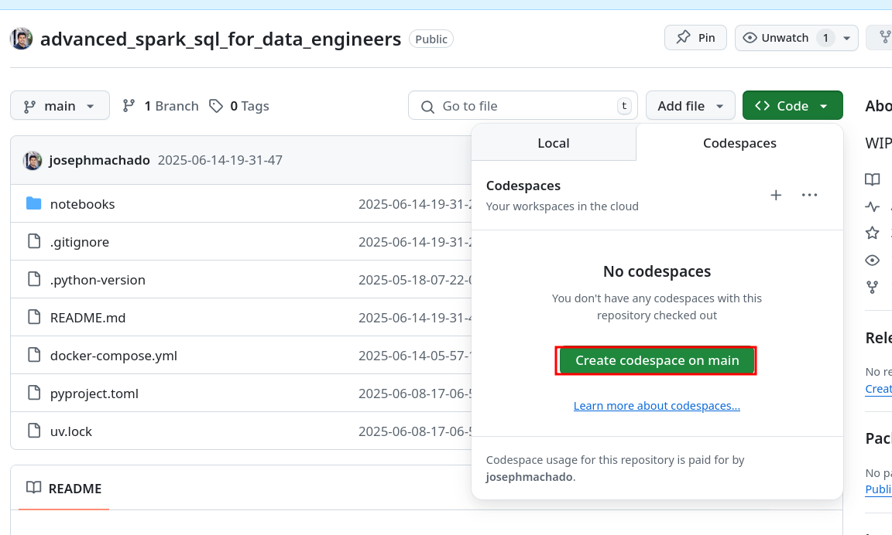
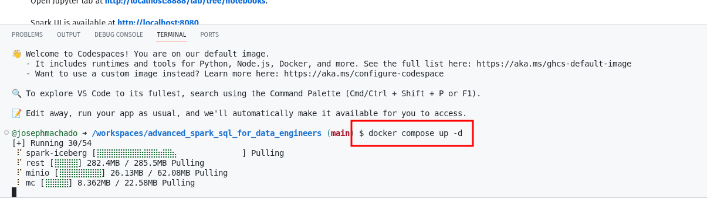
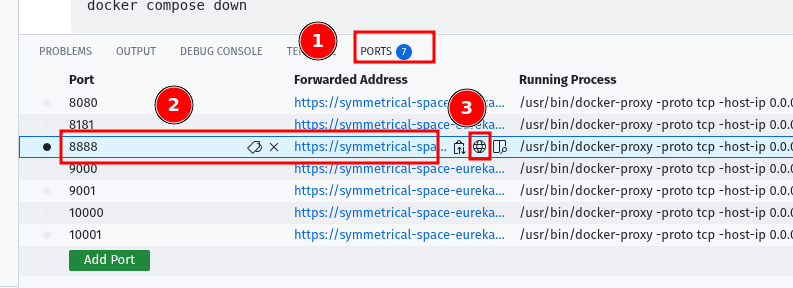
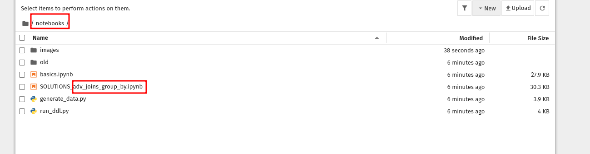
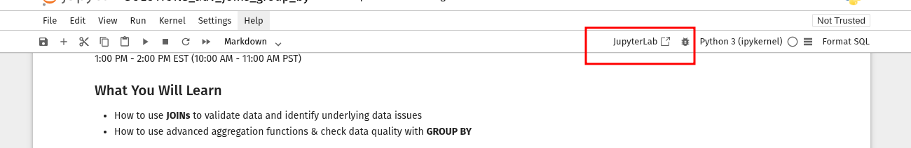
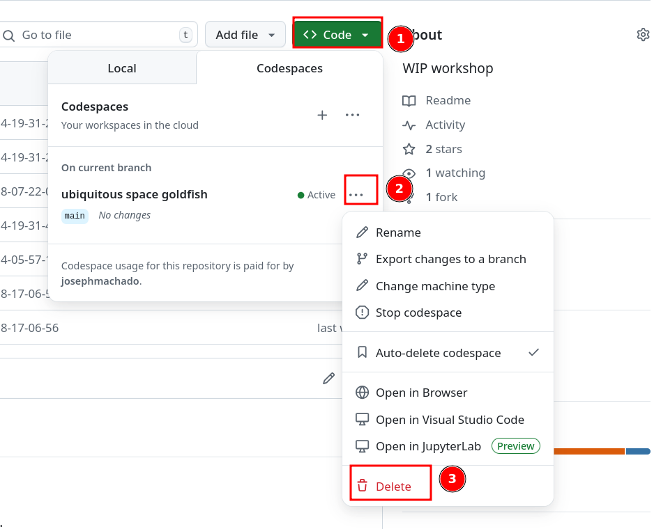

## Live virtual workshop

The workshop will be streamed on YouTube live: [Spark SQL Workshop: Advanced join & group by techniques](https://www.youtube.com/live/OPBhvZOq7oo). Post stream, it will be available to watch and follow at your own pace.

[](https://www.youtube.com/live/OPBhvZOq7oo)

### Codespaces

**Note** Please remember to switch off your code spaces.

1. Start a codespace machine .
2. Wait for the terminal to start and then run the command `docker compose up -d && sleep 30` on the terminal .
3. Click on ports tab -> click on the globe icon in the address for port `8888`. .
4. Click on the `notebooks` folder and open `adv_joins_group_by.ipynb`. .
5. Open as jupyter lab, for better experience. 

Follow along with the workshop!

**Note** remember to switch off codespaces as 


### Local with Docker

**Prerequisites**:

1. [docker](https://docs.docker.com/engine/install/) & [docker compose](https://docs.docker.com/compose/)

Start the container by cloning the repo and starting the containers (note you will have to stop other containers that you mayh have runnign on port 8888 & 8080) 

```bash
git clone https://github.com/josephmachado/advanced_spark_sql_for_data_engineers.git
cd advanced_spark_sql_for_data_engineers
docker compose up -d
sleep 30
```

Open Jupyter lab at **[http://localhost:8888/lab/tree/notebooks](http://localhost:8888/lab/tree/notebooks)**.

Spark UI is available at **[http://localhost:8080](http://localhost:8080)**.

Stop container with

```bash
docker compose down
```
